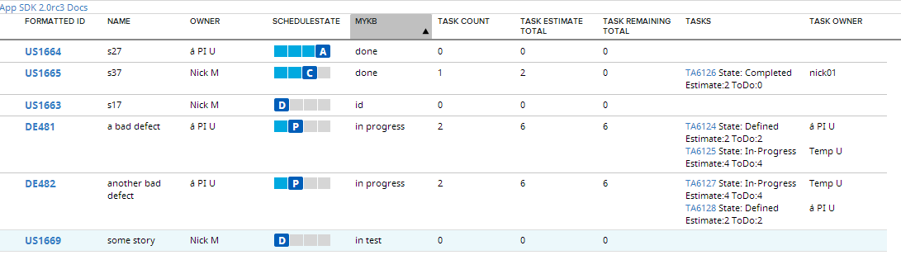

Stories and Defects of current Iteration with their Tasks
=========================

## Overview

This is an example of a grid based on a custom store that uses data returned by multi-type 'Rally.data.wsapi.artifact.Store'
## License
This app is available AS IS. It is not supported by Rally.
AppTemplate is released under the MIT license.  See the file [LICENSE](./LICENSE) for the full text.

##Documentation for SDK

You can find the documentation on our help [site.](https://help.rallydev.com/apps/2.0rc3/doc/)
